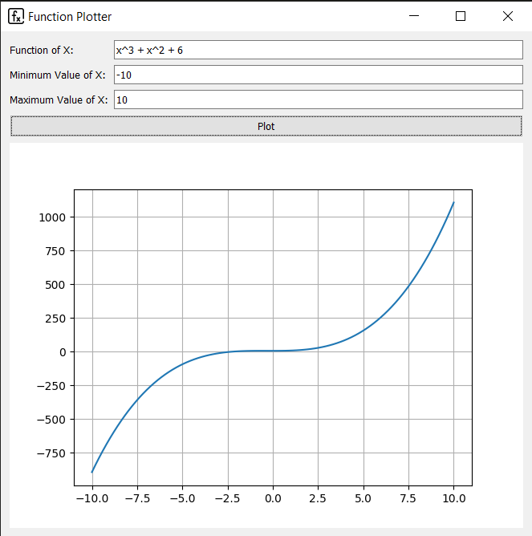
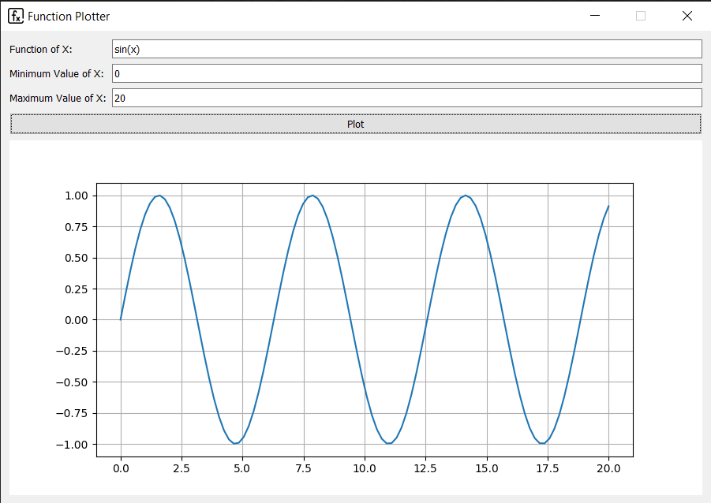
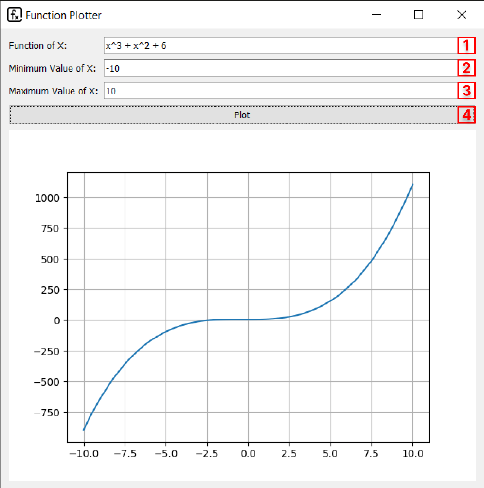
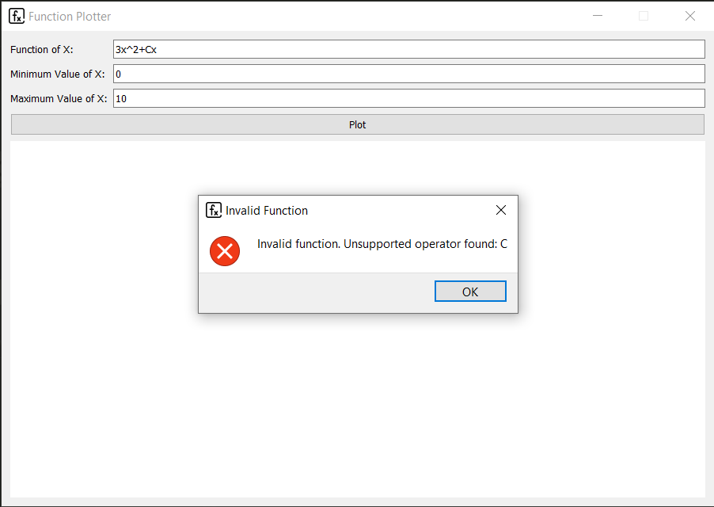
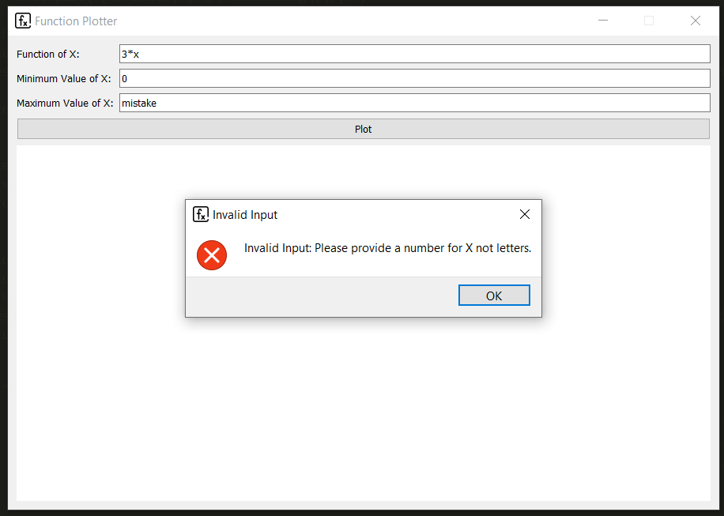
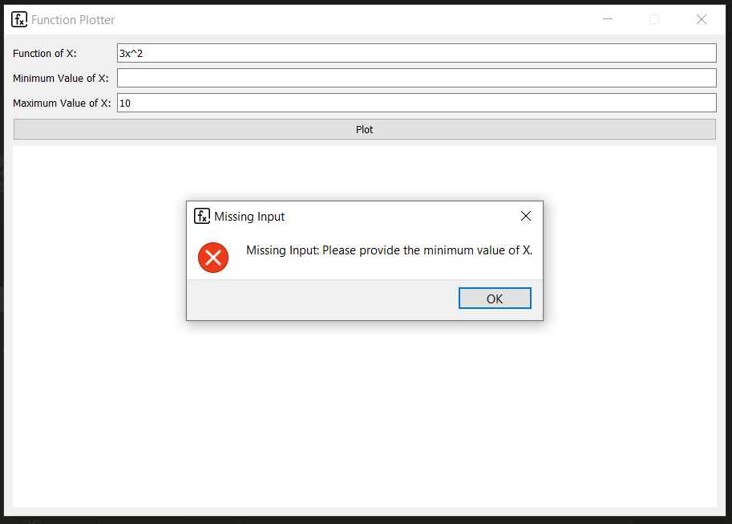
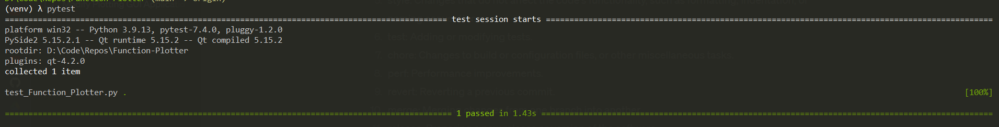

# Function Plotter

**Function Plotter is a Python application built with PySide2 and Matplotlib that allows users to plot mathematical functions (e.g., 5*x^3 + 2*x) and visualize the results on a graphical interface.**

<table>
  <tr>
    <td></td>
    <td></td>
  </tr>
</table>

## Table of Contents

- [Function Plotter](#function-plotter)
  - [Installation](#installation)
  - [Usage](#usage)
  - [Common Mistakes](#common-mistakes)
  - [Code](#code)
    - [Naming Convention](#naming-convention)
    - [Validation Layer](#validation-layer)
  - [Tests](#tests)
  - [Used Technologies](#used-technologies)


## Installation

1. Clone the repository to your local machine:
```
git clone https://github.com/youssefkhaled08/Function-Plotter.git
```

2. Navigate to the project directory:
```
cd function-plotter
```

3. Create a virtual environment for the required dependencies:
```
virtualenv venv
```

4. Install the required dependencies:
```
pip install -r requirements.txt
```

## Usage



1. Run the `Function Plotter.py` file:

   ```
   python "Function Plotter.py"
   ```

2. The Function Plotter application window will appear.

3. Enter the equation of the function you want to plot in the "Function of X" field.

4. Provide the minimum and maximum values of X in the corresponding fields.

5. Click the "Plot" button to generate the plot.

6. The plot graph will be displayed in the application window.

## Common Mistakes

<table>
  <tr>
    <th>Invalid Function</th>
    <th>Invalid Input</th>
    <th>Missing Input</th>
  </tr>
  <tr>
    <td></td>
    <td></td>
    <td></td>
  </tr>
</table>

## Code
### Naming Convention
- I followed the [Camel Case Naming Convention](https://www.freecodecamp.org/news/programming-naming-conventions-explained/).
- When naming the GUI compnents, I started the name of each component with its type, such as `ptnPlot` for a button component, and `txtFunction` for a text input component. This way, it becomes easier to search and identify the purpose or functionality of each component just by looking at its name.

### Validation Layer
**Consists of 3 Layers:**
1. **First layer:** The `validateUserInputs` function checks if the user provided all required inputs or not, and provides an error message box for any missing input.
2. **Second Layer:** The `validateFunction` function cheks if the inputted function in the right format.
    - It removes whitespaces from the inputted function.
    - Replaces `**` with the `^` operator to support its funcionality.
    - Uses Regular Expressions to check if there's any invalid operator in the function, and provides an error message box that shows the unsupported operator.
3. **Third Layer**: The `validateUserInput` function cheks if the user provided valid inputs for the minimum and maxiumu values of X, and provides an error message box for any invalid value.

## Tests
Used [Pytest](https://docs.pytest.org/en/7.4.x/) to perform end to end testing.


## Used Technologies

- IDE: [VSCode](https://code.visualstudio.com/)
- GUI: [PySide2](https://pypi.org/project/PySide2/)
- Visualization Tool (used for plotting): [Matplotlib](https://matplotlib.org/)
- Testing: [Pytest](https://docs.pytest.org/en/7.4.x/)
---
